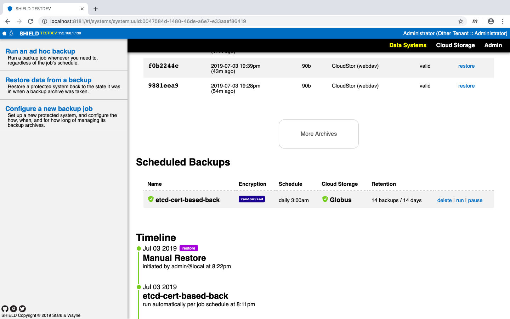

# Operator practices for using the SHIELD etcd plugin


We have successfully implemented the base plugin for implementing the validate, backup and restore functions of the etcd plugin. This document will walk you through on different types of functionalities we support coupled with our backup and restore functions. 

## Plugin usage

To be able to use the plugin, we suggest the following method:

`go get github.com/shieldproject/shield`

This will fetch the latest SHIELD release on your machine. Once you've done this, do the following:

```
cd $HOME/go/src/github.com/shieldproject/shield
cd plugin && mkdir etcd
```

Go to [https://github.com/starkandwayne/interns-summer-2019/blob/master/shield-etcd/shield/plugin/etcd/plugin.go]()

Copy this file and paste it in the etcd folder. Your directory structure should show you the following:


After this, move one level up into go/src/github.com/shieldproject/shield and edit the plugins file. It should look like the following:


We know this is not the best way to go about it. That's why, work is being done to package this as ready-to-install. 

Once this is done, do a `make clean && make shield dev`. You'll land at the tmux. This is the SHIELD testdev environment. To access it, open up [http://localhost:8181]() in your web browser.


Login with the creds username/password as "admin/password". You'll land at the homepage. All green indicators mean you're doing good so far. 

Now, before we start using the actual plugin, we need to fire up an etcd cluster to play with. Use the below commands to do that:
 
```
cd $HOME && mkdir etcd-docker && cd etcd-docker
curl -sLO https://raw.githubusercontent.com/starkandwayne/interns-summer-2019/master/etcd/etcd-cluster/docker-compose.yml
export ETCD_DATA=any_dir_on_your_machine
docker-compose up -d
```

You'll get a 3 node etcd cluster up and running. Do a docker ps to see details about the cluster. 


Let's add some data to this cluster before we test the backup and restore.

```docker exec -it name_OR_containerID sh``` e.g. ```docker exec -it etcd-docker_etcd1_1 sh```

You can use ```etcdctl put key val``` commands to define keys and their respective values. Once this is done, you can use ```etcdctl get "" --prefix=true``` to view the keys and values. In our case, we had six keys.


And we're good to go. Head back to SHEILD. Let's try backing this up. 


This part of the document deals with the anonymous authentication, where you can backup and restore without supplying any creds. That's why a lot of fields are going to be blank. Also, the docker-compose recipe binds your etcd containers' ports to different ports on your machine. You'll have to do a `docker ps` to check that and fill up that info in the `endpoint` field. You need the port that's bound to container's port 2379.


As you see above, the restore finished successfully. You can also double check that by accessing CoudStor, WebDav. You can do that via accessing WebDav at [http://localhost:8182]() as shown in the image below. 


Before moving forward, let's delete the keys in our etcd cluster to ensure we can successfully restore the data from the backup archive that we have. For this purpose, you can use `etcdctl del key`. After deletion of the keys, our cluster should output something as follows:


Let's go ahead and perform the restore operation on the etcd cluster. You can follow the steps mentioned below.


As shown above, the restore completed successfully. Let's head to our etcd cluster to check if the keys were restored.


The image above shows the successful restore. The command when first executed was before the restore job. 

## Backup and restore with auth enabled

We can `exec` into one of the running etcd containers to enable role based authentication and then issue the following commands to set things up.

```
etcdctl user add root
```
You'll be prompted for defining & confirming the password. Choose whatever you like. Just make sure they match. After that,

```
etcdctl role add root
etcdctl user grant-role root root
etcdctl auth enable
```

After this, you should be good to go. You can double check by issuing any command and you should see the following error. The error goes away when you supply the username and pass along with the command. Also, let's make sure we have some data to back up.


Now, let's get back to SHIELD and perform backup & restore. Follow the steps below. Please note that due to a bug in our code right now, You'll have to supply the certificates and keys along with the creds. You can grab them from: 

```
https://github.com/starkandwayne/interns-summer-2019/blob/master/etcd/etcd-cluster-secure/server.crt
https://github.com/starkandwayne/interns-summer-2019/blob/master/etcd/etcd-cluster-secure/server.key
```
Place them in SHIELD's top level directory. After that, go to SHIELD's UI and edit the `etcd-docker` data system as follows:


After this, configure a new backup job. Choose `etcd-docker` as the data system and `CloudStor` as the storage. 


Let's go back to the etcd cluster and delete some values to see if the restore goes through okay. We have deleted `key1` and `key2` for now. On a successful restore, they should reappear.


Get back to SHIELD and restore using the archive we just created.


All looks okay. You can switch back to the etcd cluster and see that the deleted keys got successfully restored. 

## Backup and restore on a secure etcd cluster (Cert-based auth)

In this section of the document, we'll enable certificate based authentication. 

To do this, you'll need to use a different docker-compose recipe which you can grab by the following method:

```
mkdir etcd-secure-cluster-data && cd etcd-secure-cluster-data
curl -sLO https://raw.githubusercontent.com/starkandwayne/interns-summer-2019/master/etcd/etcd-cluster-secure/docker-compose.yml
``` 

Before we can fire up the cluster, we need to place the certificates and the keys at respective locations. For this, you need the following two files

```
https://github.com/starkandwayne/interns-summer-2019/blob/master/etcd/etcd-cluster-secure/server.crt
https://github.com/starkandwayne/interns-summer-2019/blob/master/etcd/etcd-cluster-secure/server.key
```
Place these files in `etcd-secure-cluster-data` and SHIELD's repo that exists at `$HOME/go/src/github.com/shieldproject/shield`. The first step ensures that the etcd cluster locates the certs and keys to enable TLS. The second step will make life easier for you while you'll be specifying fields.

After this, let's go ahead and spin up our cluster. `docker-compose up -d` will bring up our cluster in the detached mode. The next step is to add data to this cluster. For that, let's `exec` into one of our containers and set it up.

You have to include `key`, `cert`, `cacert` and `endpoints` before executing any command in a secure etcd cluster. See below for the necessary steps to be followed.


Let's go ahead and back up this secure etcd cluster. Edit the `etcd` data system and add `https://localhost:port` in the endpoint field.
 


Let's get back to the etcd cluster and delete some values before we initiate the restore function. 


Let's initiate the restore function.




Let's log into the cluster and check if the keys reappeared.


## Backing up with a prefix

You can also leverage the option of backing up keys with a specific prefix. This can be extremely useful in restoration of any keys which would have been corrupted over the time. Let's spin up a non auth etcd cluster and add some keys which have the prefix `starkandwayne`. 


Let's define a new data system with the prefix option enabled. Specify `starkandwayne` as the prefix


So, after restore we get all our prefixed keys back.


 


